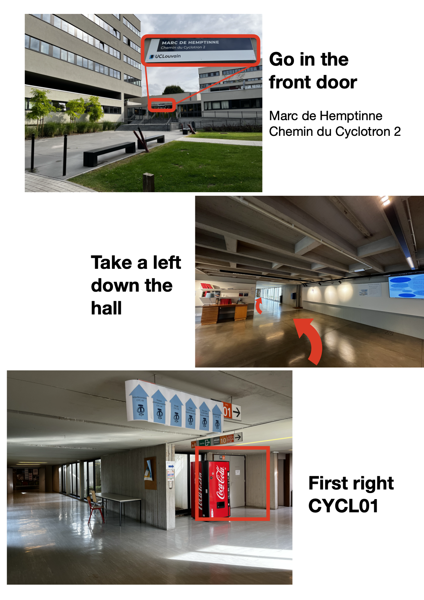

# Oisín's Public Defence
*16:15, Tuesday 16th of September, Louvain-la-Neuve*

Hi there, here is some information about the public defence, and how to find the rooms.

## Travel Information
From Brussels, take the train for Louvain-la-Neuve. **Attention 'Louvain-la-Neuve' and 'Louvain/Leuven' are not the same place!**. Check the [SNCB](https://www.belgiantrain.be/en) for the best route. The journey takes about 40 minutes from Brussels-Luxembourg station, and sometimes requires a transfer in Ottignes. A return journey from Brussels is €13.

## Defence

The defence itself will take place in the lecture hall CYCL01, in the Cyclotron building. This is about a 15 minute walk from the train station. Here is a maps link for the entrance: [map link](https://maps.app.goo.gl/NSMrKuSxrqyQHUKr9?g_st=ipc). Once you arrive at the building, the below picture shows how to find the room:

*Text of image:*

The main entrance is marked as Marc de Hemptinne - Chemin du Cyclotron 2. 

Once inside the building, take a left down the hall, and then the first right. The room CYCL01 will be on your left.

## Reception
At around 18:00 we will walk over to the De Serres hall ([map link](https://maps.app.goo.gl/spzMsxsPinMgMswq5)). Access into this building can be tricky, so if you are arriving later please give me a call if you cannot find the entrance.

## Video Link
If you cannot make it, but would still like to watch, you can join the presentation with this link:
[Oisín's Defence](https://teams.microsoft.com/l/meetup-join/19%3ameeting_YmVjNzk4OTUtMTIyNi00OWNmLThmNjEtODI5NTNkNGJlYWFk%40thread.v2/0?context=%7b%22Tid%22%3a%227ab090d4-fa2e-4ecf-bc7c-4127b4d582ec%22%2c%22Oid%22%3a%22cc0e3fe6-f818-40ea-b0ec-0dc07a205fe7%22%7d)

Or through MS Teams:

Meeting ID: 374 137 889 091 6

Passcode: oy7TC3Tx
