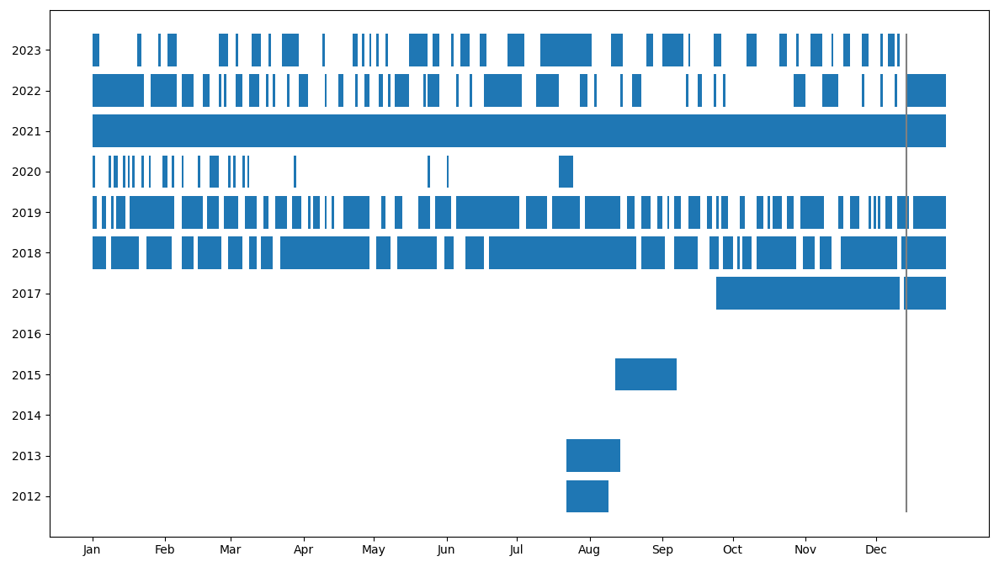
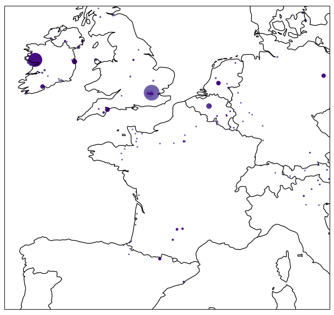

I use a python tool to store my daily journals. This tool can autogenerate maps of the locations I spend each day, and create a combined journal entry for a given day on each year. The idea for this came from the 'Line a day - 5 year diary'.

Some outputs are shown below.

Dates for which I have diary entries:

Locations of each diary entry:

---

The python repo can be cloned from [github](https://github.com/ushham/JournalTool).

I use [Obsidian](https://obsidian.md) to write the daily journals in markdown.

