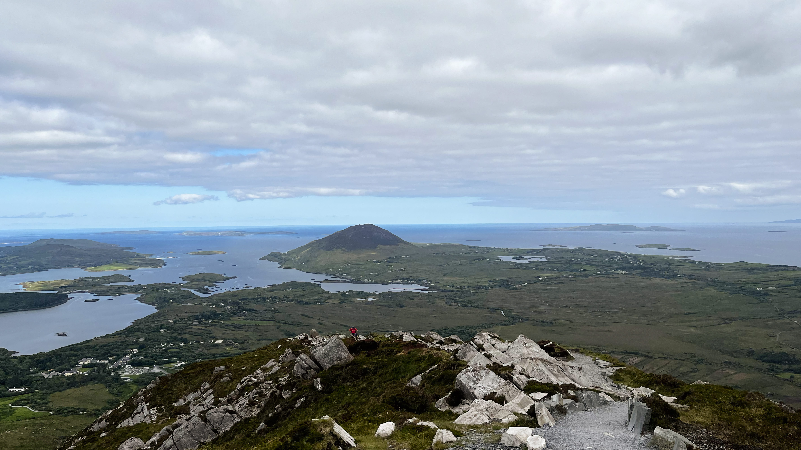
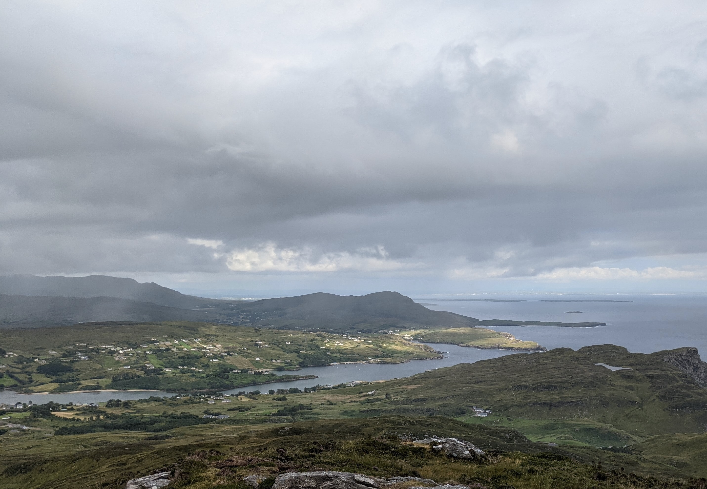

Written with [Éabha Jones](https://eabhajones.substack.com/?utm_campaign=profile_chips).

Last week we heard Simon Harris confirm his Government’s plan to reverse their 20 year stance on one-off housing (OFH). For the uninitiated, the debate around OFH or ribbon developments looks like a no-brainer: more houses, on cheap land, next to your parents. 

OFH is exactly what it says on the tin. Ribbon developments are similar, it is a string of neighbouring houses not connected to a village. Your grandparents own an acre, your parents build on that acre and then you build across from that acre. But when everyone does this, then no one gets any of the benefits of what is called a ‘critical mass’. 

When 100 families are spread across kilometres they end up relying on their car to live their daily life - going to the shops, the hairdresser, school runs, training, coffee, the pub. OFH also means that you, the taxpayer, has to pay more for the maintenance of getting services to these dispersed houses. Not to mention the cost to the individual home owner to connect to the grid, their second car, and time - the time it takes to keep driving into town to do the things we need to do every day. This sort of housing sucks local villages dry, because no one ends up living in them. 

*Most of Ireland's countryside is scattered with the white dots of houses.*

These are the reasons why the Government restricted OFH 20 years ago. Due to its small size, Ireland has the ability to allow people who want to live in rural communities the option to do so, and be within commuting distance to a larger city. But towns only work when people want to live in them. And that is Ireland’s problem at the moment. The good news is that they can work, and it is not that hard. 

Think of every town or village in Ireland. They will all have a main road bisecting them. They have evolved to envelop this road. Meaning that when you drink a cup of coffee outside your local cafe, you will be either in a car park, or within meters of a car travelling at 50km/h. Roads are a vital part of rural Ireland’s transport. But for our towns to work we need to clarify which parts are for moving people from A to B, and which parts are for people to live. The bypass is for moving people, while the centre of towns are for local communities to flourish. Bypasses were considered a death knell for rural villages. But these places had evolved to cater only for passers by, like an Applegreen does today, not for those living there. The road was the village. The bypass did not kill them, they were already dead . 

A bypassing road can be as simple as being one block from the pedestrianised village centre, they just need to be separated. This is a tried and tested solution which is better for everyone, drivers have a faster less obstructed way, and people outside of cars have the space and safety to mingle. If you provide accessible parking places for drivers to easily stop and walk to the village centre, your village becomes a place people want to stop, becoming a destination in itself, helping to boost the local economy. 

There has always been reluctance to pedestrianise our urban centres because business owners fear a loss of footfall. But it’s called footfall for a reason. People don’t buy things inside their car. Cars have the effect of creating a false sense of busyness. A place isn’t described as bustling by the amount of traffic it has but by the number of people walking on the streets. Put it this way; next time you are in town, think of every time you have to raise your voice to be heard over the traffic, every time you are worried about your child stepping out into the road, every time you sit in a car park with a latte. If that is the case, this place was not designed for you, it is hostile to you. We have to remember the town square and how important it is as a public space, for all ages to gather. In most Irish towns, it is now a road. 

*Most views in Ireland will show the scale of the one of housing we already have. There is no need to add more.*

For people to want to spend time in our rural towns they also need to be beautiful. There is a reason why wealthy suburbs are referred to as ‘leafy’ - we should not underestimate the power of trees, providing shade in the summer and beautiful foliage in the autumn. But this should not be a substitute for accessing the countryside. Schemes encouraging private landowners to allow tracks and trails across Ireland could be made a priority. This isn’t pie in the sky stuff, it’s done across Europe and Britain . We should also remember our often forgotten waterways. These have the potential to be stunning riverside walks, places for watersport and habitats for our wildlife. And it’s to our shame that we are not taking responsibility for celebrating them .

It is high time that we remember how beautiful our rural centres are. We need to add to this beauty by building considered homes that people are excited to live in, not just thankful that there is something they can afford. For too long we’ve suffered passing derelict homes in the centre of our towns. Our often beautiful older public buildings too, fall into disrepair. And the blame for this can’t solely be laid at the Government’s feet. Our Councils have a role to play in this, making the possibility for change so much closer to home. 

If we roll back on OFH restrictions then any hope of trying to get those people (who are already rurally inclined) back into towns and villages becomes all the more difficult. Not only that but it increases the bill for the tax payer and the home owner. It is a political sleight of hand - just as the debates recently have been about how big a given subsidy should be, rather than tackling the root of an issue , increasing OFH provides a false solution under the guise of ‘helping’ rural Ireland. When in fact removing restrictions to one-off housing distracts from the real issue at hand: the lack of vision for rural Ireland's future.
