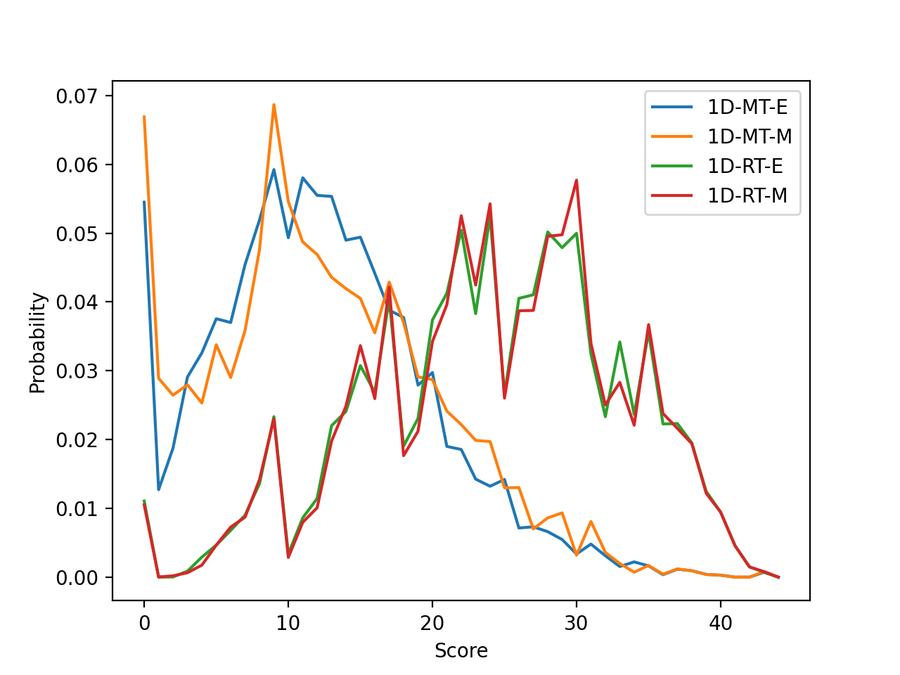
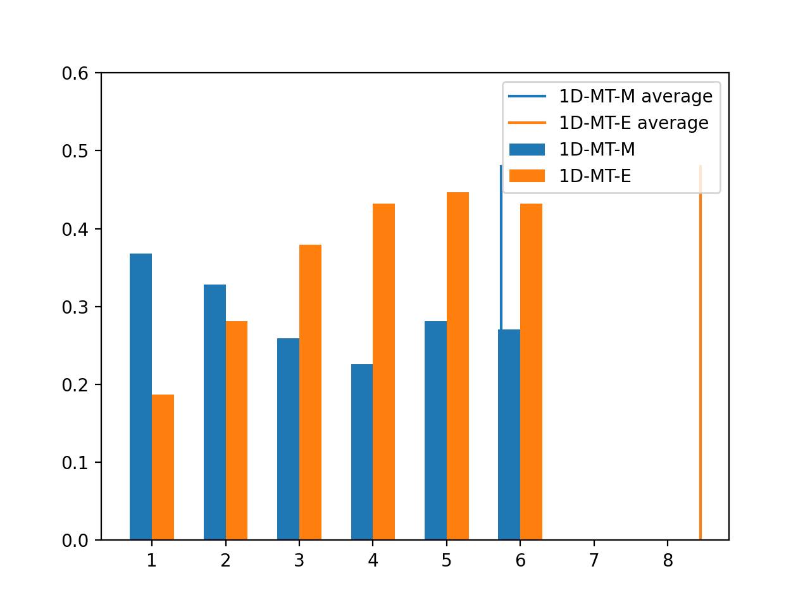
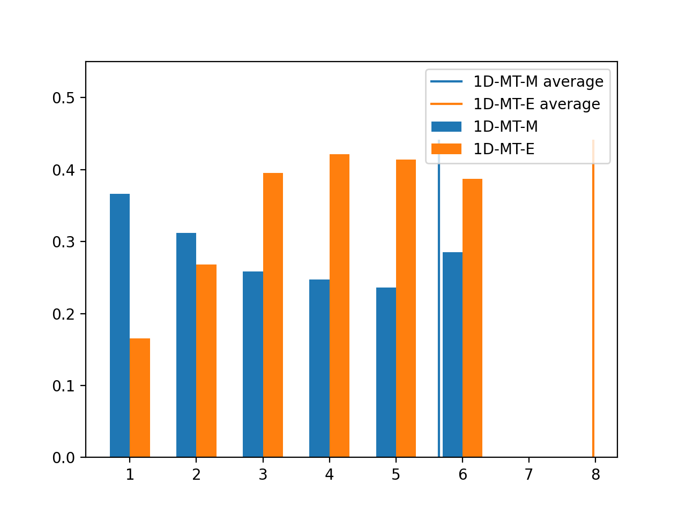
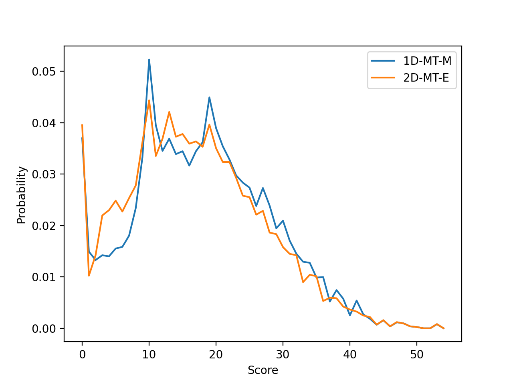
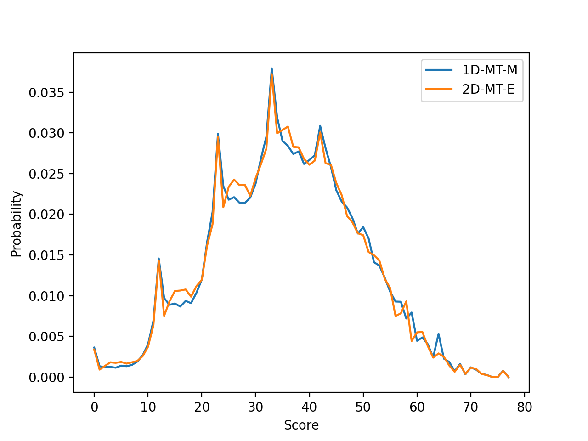
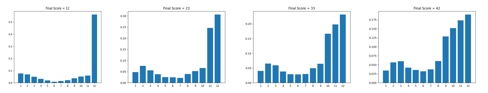

Coding project to numerically analyse the best strategies to win the game [shut the box](https://en.wikipedia.org/wiki/Shut_the_box).
The code used to run these simultions was written in Julia, Python, and Fortran 2008 and can be found [here](https://github.com/ushham/Shut-The-Box/tree/master).

## Summary
These are the stratigies to follow for the 9, 10, and 12 tile version of the game. Results are given for 1 and 2 dice variants of the game, where the 1-dice variant allows the player to use only 1 dice when the remaining tiles have a maximum value of 6.

**Maximize chance of closing the box**

If you are playing the **1-dice** variant, reduce the number of tiles removed each dice roll, and if you must remove more than 1 tile for a given roll, remove the tile combinations that have the **minimum** distance between the largest value and smallest value tiles.

For example, if you roll a 7, remove the tiles in this order of preference: [7], [3, 4], [2, 5], [1, 6], [1, 2, 4].

If you are playing the **2-dice** variant, reduce the number of tiles removed each dice roll, and if you must remove more than 1 tile for a given roll, remove the tile combinations that have the **maximum** distance between the largest value and smallest value tiles.

For example, if you roll a 7, remove the tiles in this order of preference: [7], [1, 6], [2, 5], [3, 4], [1, 2, 4].

**Minimise average score**

In all versions of the game, if you want to minimise the average score you have when you run out of moves, the best strategy is to only close one tile for each dice roll, and if you must close more than 1 tile for a given roll, remove the tile combinations which have the **maximum** distance between the largest value and smallest value tiles.

For example, if you roll a 7, remove the tiles in this order of preference: [7], [1, 6], [2, 5], [3, 4], [1, 2, 4].

## Game:
Shut the box is a game where the player is trying to remove tiles numbered 1 to 'x' by rolling dice. The player can remove any combination of tiles that sum to the dice total. Once the tiles are removed, they cannot be used again. The player is aiming to remove all tiles. For example, if the player rolls 7, they can remove the tile(s)numbered: [7], [1, 6], [2, 5], [3, 4], or [1, 2, 4].

Winning the game can depend on the version being played, but here I look at methods to reduce the average score (sum of all tiles left in the game), or to maximise the probability of removing all tiles.

## Results:

See the [wiki](https://en.wikipedia.org/wiki/Shut_the_box) for details on the game.

<u>Open Tiles:</u> Tiles which have not been removed from the game.

<u>Score:</u> the sum of all open tiles at the end of the game.

<u>1 Dice / 2 Dice:</u> 1D is when the player must use one dice when the open tiles have value 6 or less, 2D is when the player must use two dice at all times.

### Introduction

I ran numerical tests for the 9, 10 and 12 box varients of shut the box.

I assumed the dice rolls are done using two 6-side dice, unless stated. However, I also ran a version of the game where you must use one dice once the largest tile left open is less than or equal to 6.

I experiemented with changing the strategy of which tiles are dropped if there are multiple permutations of tile drops availible. These strategies are described below.

### Strategies

**Maximise tiles - Extremes (MT-E)**

This strategy assumes that the player is trying to reduce their total score. Each dice roll will reduce the player's score the same amount, no matter which combination of tiles are closed. For this reason, the player should close the fewest number of tiles to leave the maximum number of tiles open to increase the liklihood of further dice rolls rolling an open tile number(s).

In this strategy, for each dice roll, the code will try to only close the one tile for each dice roll, if this is not possible it will try a combination of two tiles, and so on. There may be multiple permutations of two (or more) tile closures. For example, if a 12 is rolled, then the possible permutations are [3, 9], [4, 8], and [5, 7]. When this is the case, I choose the highest and lowest numbers (so for this example [3, 9]). This is done to ensure the remaining open tiles are more likely to be close to 7, which is the most likely score with a two 6-sided dice.

**Maximise tiles - Mid (MT-M)**

Same as MT-E, but I reversed the preference for permutations when multiple tiles had to be closed. In this example we would preference [5, 7].

**Reduce tiles - Extremes (RT-E)**

In this method I try to reduce the number of tiles open in each game. To do this I maximised the number of tiles closed with each dice roll. For example, if I roll 12 in the first roll of the game, I would close [1, 2, 3, 6]. Again, when there is an option between permutations of the same number of tile closures, we use the permutations where there is the largest difference between the lowest and highest tiles.

**Reduce tiles - Mid (RT-M)**

Same as RT-E but if there are multiple permutations availible of the same length, the one which has the smallest gap between first and last tile numbers is picked.

### 9-Tile varient

**1 Dice:**

| Variant | MT-E | MT-M | RT-E | RT-M |
| --- | --- | --- | --- | --- |
| Probability of winning | 5.45% | 6.69% | 1.11% | 1.05% |
| Average score | 12.27 | 12.41 | 24.14 | 24.23 |
| Average No. open tiles | 2.50 | 2.45 | 3.55 | 3.54 |

The below graph shows the probability of ending the game on a given score, for each of the strategies. The spikes represnt scores which are more likely to end on, for example, all strategies show a peak at the value 9, which mainly results from the tile with value 9 being left open. The RT tile strategies result in higher average scores due to the lowest value tiles being closed first, this then leaves the player with only higher numbers to close, which require specific dice rolls to close.

In this case the MT-M strategy results in a higher probability of winning compared to the MT-E strategy. This is due to the MT-M strategy tending to have a higher proportion of low value tiles, once the 1-dice rule is triggered. This is becasue the stragegy purposely closes the intermediate value tiles as a priority. 

The average for the MT-M strategy is 5.72, compared to 8.44 for the MT-E strategy. As only one dice can be used from this point on, on average the MT-E strategy will require two or more dice rolls to win the game, where as the MT-M strategy, on average, could be won with one dice roll. The fact that the average score is low enough for a game to be won with one dice roll, compared to at least two, explains why the probability of winning the once dice version of the game using this strategy is higher. The below image shows the probability of individual tiles being open once the one dice rule is triggered, where multiple tiles can be open at the same time, so the sum of probabilities is greater than 1.

**2 Dice:**

| Variant | MT-E | MT-M | RT-E | RT-M |
| --- | --- | --- | --- | --- |
| Probability of winning | 6.95% | 6.06% | 1.05% | 1.03% |
| Average score | 11.38 | 12.20 | 24.16 | 24.21 |
| Average No. open tiles | 2.34 | 2.47 | 3.56 | 3.54 |

In the two dice version the MT-E stategy is the optimal out of those tested. As suspected, this approach leads to fewer open tiles in each game, even though the stategy aims to keep as many tiles open per round as possible.

### 10-Tile varient

**1 Dice:**

| Variant | MT-E | MT-M | RT-E | RT-M |
| --- | --- | --- | --- | --- |
| Probability of winning | 3.34% | 3.69% | 0.37% | 0.38% |
| Average score | 17.23 | 17.93 | 32.35 | 32.37 |
| Average No. open tiles | 2.96 | 3.02 | 4.35 | 4.32 |

Again, the MT-M provides a better strategy in the 1-dice version of the game, as explained in the 9 tile variant.

As shown in the graph below, the average for the MT-M strategy is 5.65, compared to 7.97 for the MT-E strategy.

**2 Dice:**

| Variant | MT-E | MT-M | RT-E | RT-M |
| --- | --- | --- | --- | --- |
| Probability of winning | 3.93% | 3.32% | 0.35% | 0.36% |
| Average score | 16.88 | 17.85 | 32.38 | 32.37 |
| Average No. open tiles | 2.90 | 3.03 | 4.35 | 4.32 |

In the below image I show the probability of ending at a given score for the two most successful 1 and 2 dice varients.

### 12-Tile varient

**1 Dice:**

| Variant | MT-E | MT-M | RT-E | RT-M |
| --- | --- | --- | --- | --- |
| Probability of winning | 0.34% | 0.36% | 0.016% | 0.016% |
| Average score | 35.36 | 35.66 | 53.89 | 53.85 |
| Average No. open tiles | 4.52 | 4.59 | 6.19 | 6.17 |

**2 Dice:**

| Variant | MT-E | MT-M | RT-E | RT-M |
| --- | --- | --- | --- | --- |
| Probability of winning | 0.34% | 0.33% | 0.012% | 0.013% |
| Average score | 35.37 | 35.66 | 53.91 | 53.83 |
| Average No. open tiles | 4.52 | 4.59 | 6.20 | 6.17 |

Below I show the probability of ending on a given score for the two most successful strategies of the 1 and 2 dice varients. In the 12 tile version of the game, the one dice varient of the game has a (very slightly) higher probabiliy of resulting in a winning game.

This graph shows some very pronounced spikes around the final scores of 12, 23, 33, and 42. These spikes usually result from the highest tiles remaining open. Note that the y-axis is not uniform in each of the bar charts.

---

<small>
Header picture from the wikipedia page:
By Roland Scheicher / Roland Scheicher at German Wikipedia - Self-photographed, Public Domain, [https://commons.wikimedia.org/w/index.php?curid=26074395](https://commons.wikimedia.org/w/index.php?curid=26074395)
</small>
