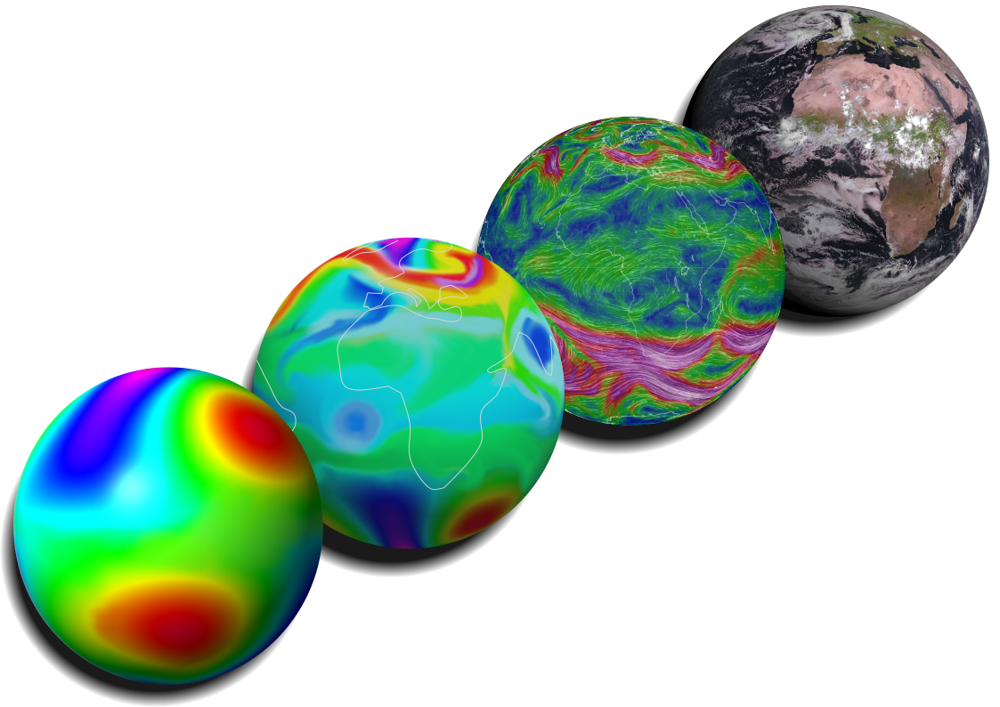

I collaborated on an introductory blog post, with colleges at the Royal Meteorological Institute of Belgium, about why toy models are used in climate science.

You can read the blog [here](https://blogs.egu.eu/divisions/cl/2022/09/18/simple-is-good-how-we-understand-climate-using-idealised-models/).
